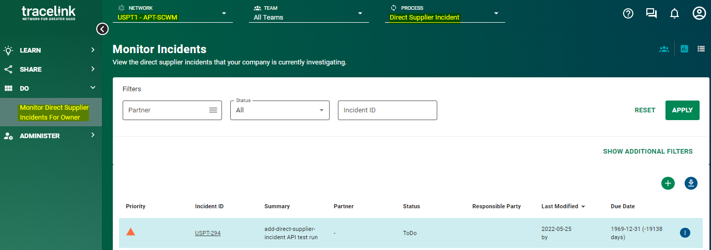
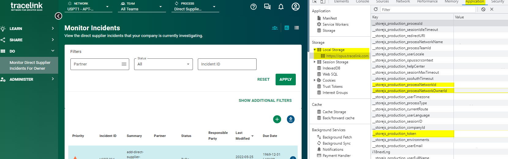
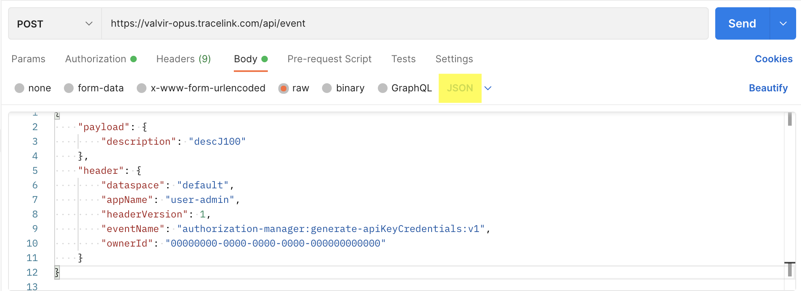

# Authentication 

## Prerequisites 

1. You must be able to login to the Opus Platform and access APT-SCWM. 

2. Once logged into Opus on your browser, select the desired process. For example, **Direct Supplier Incident**. 



3. Using the directions below for your designated, generate the following values:

- `_store_js_production_processNetworkOwnerId`
- `_store_js_production_processNetworkId`
- `_store_js_production_token` (a short lived token)

### Chrome

From the Chrome menu, navigate to **View** > **Developer** > **Developer Tools**.
Select the **Application** tab from the Developer Tools pane. From the left hand navigation menu, under the storage section, select
**Local Storage** from the dropdown. Then, click `https://opus.tracelink.com`. You should now see a list of key/value pairs. 



### Firefox

From the Firefox menu, navigate to **Tools** > **Web Developer Tools**.
Select the **Storage** tab from the Web Developer Tools pane. From the left hand navigation menu, click **Local Section** and then
`https://opus.tracelink.com`. You should now see a list of key/value pairs. 

## Generate API Key and Secret

### Postman

1. Set up a POST call to `https://valvir-opus.tracelink.com/api/events`.
2. Under the **Authorization** tab select **Bearer Token** as the **Type** and insert the `_store_js_production_token` obtained
from your browser as the **Token**.


3. Click the **Body** tab and use the JSON below. Do not replace any values, including the ownerID. Ensure **raw** and JSON are selected.

```json
{
    "payload": {
        "description": "descJ100"
    },
    "header": {
        "dataspace": "default",
        "appName": "user-admin",
        "headerVersion": 1,
        "eventName": "authorization-manager:generate-apiKeyCredentials:v1",
        "ownerId": "00000000-0000-0000-0000-000000000000"
    }
}
```



Here is an example response: 

```json
{
  "header": {
    "headerVersion": 1,
    "eventName": "authorization-manager:generate-apiKeyCredentials-response:v1",
    "ownerId": "00000000-0000-0000-0000-000000000000",
    "isErr": false,
    "errCode": "200_OK",
    "licensePlate": "lrYvpv-0Cj4nC"
  },
  "payload": {
    "apiKey": "10e1c36c-2f49-46f3-b552-e28b5d671b5f",
    "apiSecret": "jt3x1xz0LxLbRyMhPMuuObbabnNxbpFk"
  }
}
```

The API key and secret are long-lived, static values that do not expire. 

## Encode API Key and Secret

1. Take the values of `apiKey` and `apiSecret` and convert them into a string with the format {{KEY}}:{{SECRET}}, with a colon seperating the two values. 

   For example: `10e1c36c-2f49-46f3-b552-e28b5d671b5f:jt3x1xz0LxLbRyMhPMuuObbabnNxbpFk`.

2. Use the following command in your terminal window to encode the string: `echo -n 'KEYSECRETSTRING' | base64`

   For example: `echo -n '10e1c36c-2f49-46f3-b552-e28b5d671b5f:jt3x1xz0LxLbRyMhPMuuObbabnNxbpFk' | base64`.
   An example response: `MTBlMWMzNmMtMmY0OS00NmYzLWI1NTItZTI4YjVkNjcxYjVmOmp0M3gxeHowTHhMYlJ5TWhQTXV1T2JiYWJuTnhicEZr`.

   Alternatively, you can use an online resource such as https://www.base64encode.org/ to encode your string.

3. This encoded result can now be used in a basic authorization header. 
   For example, `authorization: Basic NGFiZjAyMjItZmU…M3Y2ZzFvZEFPQ1F5RUFKSkI3TWpNOFRFNVpw`.


### Python 

```python
import base64

def create_token(api_key, api_secret):
    combine = api_key + ':' + api_secret
    step_two = combine.encode("UTF-8")
    encoded_token = base64.b64encode(step_two).decode("UTF-8")
    auth_header = {"Authorization" : "Basic %s" % encoded_token}
    print(auth_header)
```


